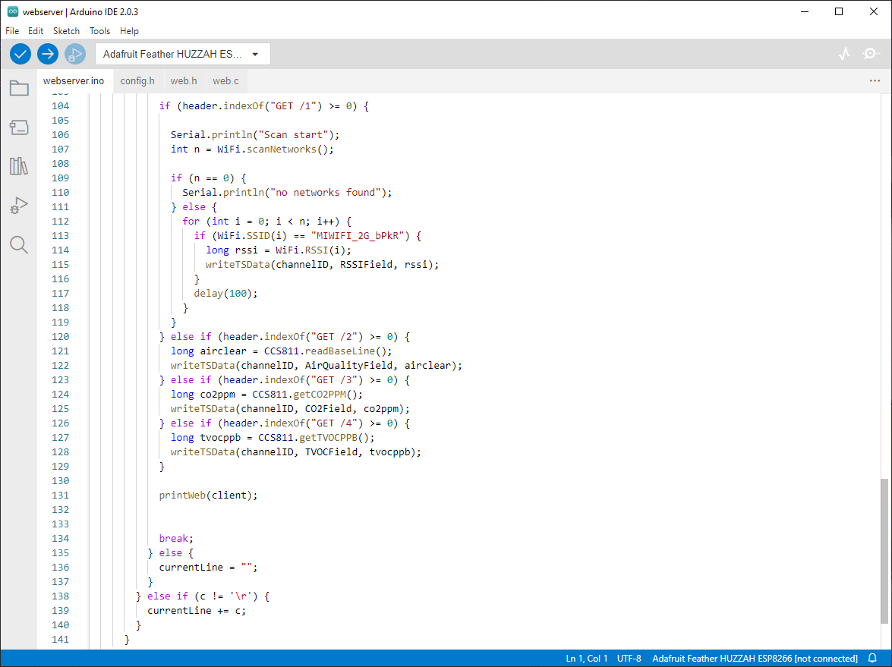
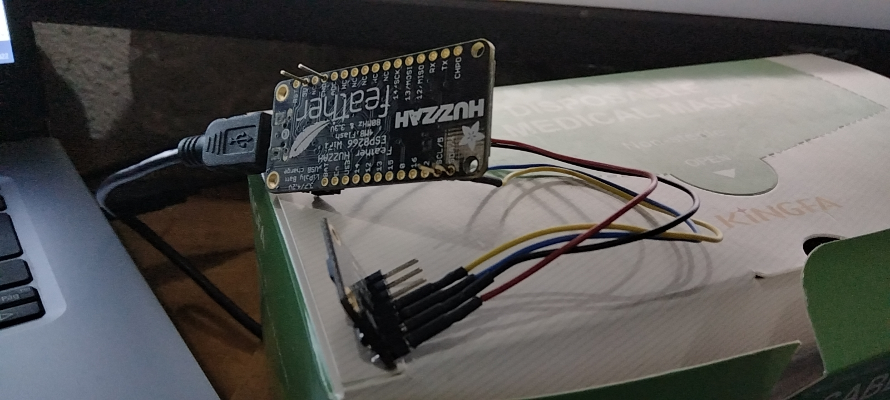
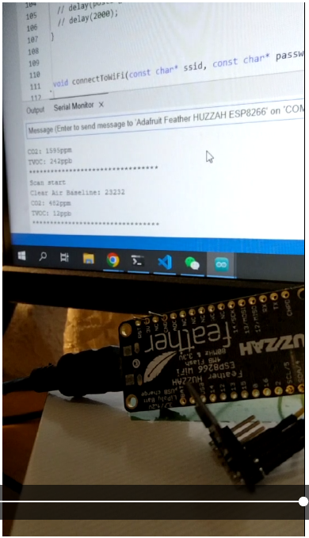
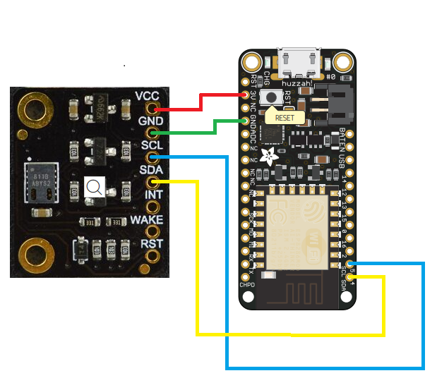
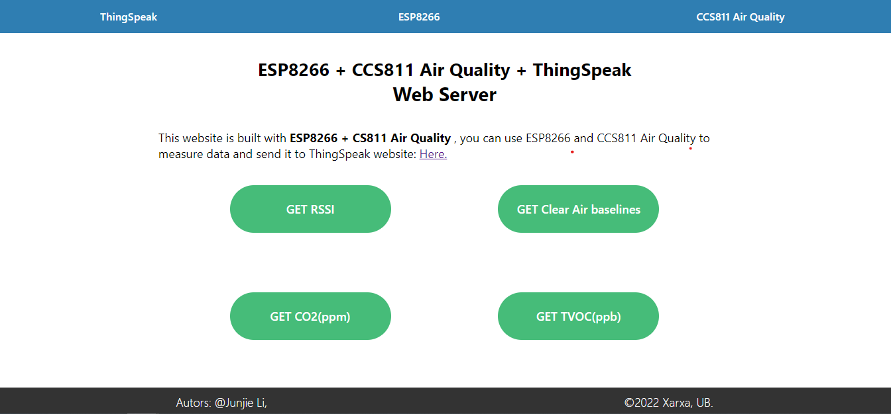

# ESP8266 + CCS811 + ThingSpeak

 ESP8266 + CCS811 + ThingSpeak: Air Quality web server

The purpose of this project is to create a Wi-Fi enabled web server that can send information to the server with a CCS11 air detector and display it on a Thingspeak web page in real time, compatible with multiple ESP8266 variants.

## Hardware

The hardware is based on the adafruit-feather-huzzah ESP8266 board and uses an CCS811 Air Quality Sensor (Breakout) to check the air condition and quality. Wire seen in the schematic are variable and will depend on the specifications of on the versionCSS811. 

Shopping List:

    - ESP8266
    - CSS811
    - ThingSpeak

These are just quick Amazon references. Parts can be purchased cheaper with longer shipping times from places like AliExpress

## Structure

# Web Server

# ThingSpeak

