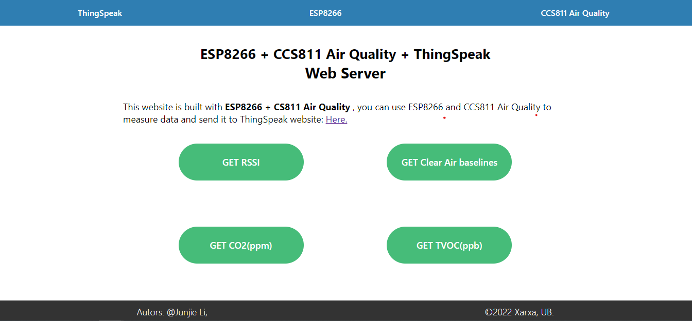
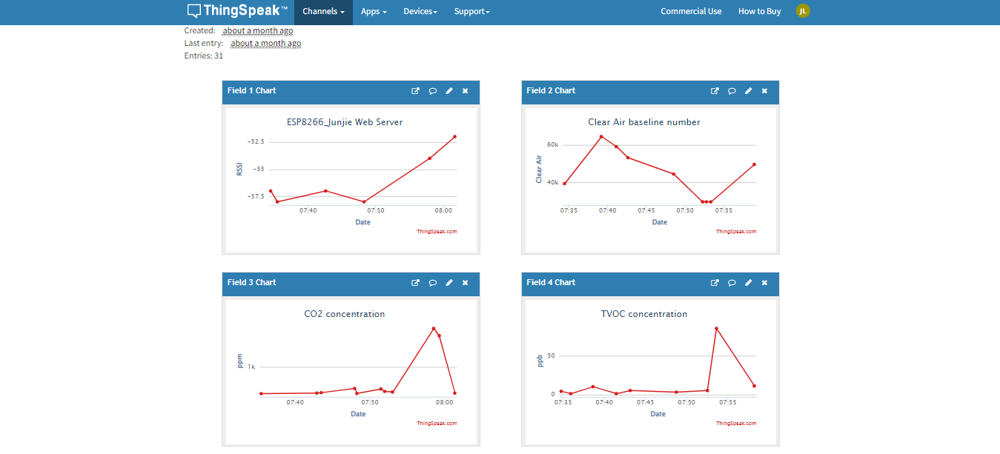
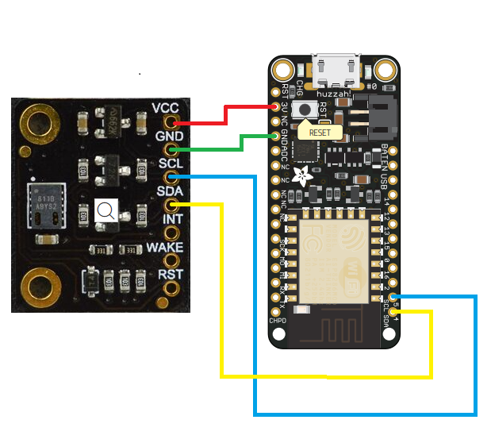
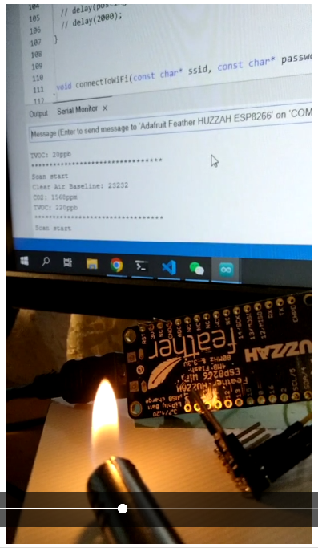
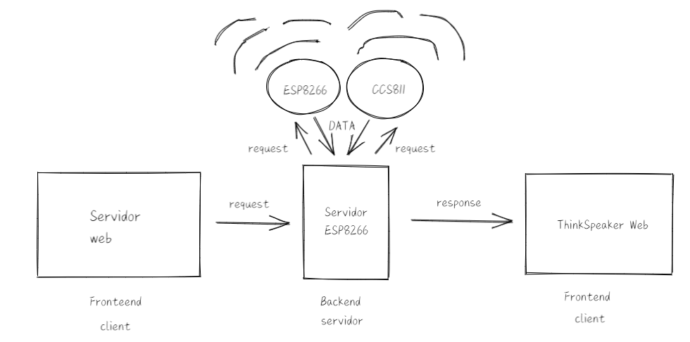

<div align="center">

# ESP8266 + CCS811 + ThingSpeak: Air Quality Web Server





</div>

The purpose of this project is to create a Wi-Fi enabled web server that can send information to the server with a CCS11 air detector and display it on a Thingspeak web page in real time, compatible with multiple ESP8266 variants.

## Table of Contents

- [ESP8266 + CCS811 + ThingSpeak: Air Quality Web Server](#esp8266--ccs811--thingspeak-air-quality-web-server)
  - [Table of Contents](#table-of-contents)
  - [Requirements](#requirements)
  - [Install](#install)
  - [Usage](#usage)
  - [Hardware](#hardware)
  - [Testing](#testing)
  - [Service Structure](#service-structure)
- [Web Server](#web-server)
- [ThingSpeak](#thingspeak)
  - [Documentation](#documentation)
  - [Issues](#issues)
  - [License](#license)

## Requirements

- Hardware:
  - [ESP8266](https://www.esp8266.com/)
  - [CCS811](https://wiki.dfrobot.com/CCS811_Air_Quality_Sensor_SKU_SEN0339)
- Statistics server:
  - [ThingSpeak](https://thingspeak.com/)
- Development tools:
  - [Arduino IDE](https://www.arduino.cc/en/software)

Any hardware needed can be purchased online.

## Install

Clone to local directory:

`$ git clone https://github.com/junjielyu13/ESP8266-CCS811-ThingSpeak.git`

## Usage

1. [Register](https://thingspeak.com/login?skipSSOCheck=true) and [configure](https://thingspeak.com/channels/new) the **ThingSpeak** service, and replace the **Channel ID**, **WRITEAPIKEY**, **READAPIKEY** words in the [**.env**](.env) file and [**config**](./webserver/config.h) file:

```py
  WEB = https://thingspeak.com/channels/***********
  THINGSPEAKADDRESS = api.thingspeak.com
  CHANNELID = ***********
  WRITEAPIKEY = ***********
  READAPIKEY = ***********
```

2. Connect ESP8266 and CCS811 according to the ports shown in the figure:

<div align="center">



</div>

3. Load project code with arduino, and configure the following libraries:

   - ESP8266WiFi: https://arduino-esp8266.readthedocs.io/en/latest/installing.html
   - ThingSpeak: https://www.arduino.cc/reference/en/libraries/thingspeak/
   - DFRobot_CCS811: https://www.arduino.cc/reference/en/libraries/dfrobot_ccs811/

```c
#include "ESP8266WiFi.h"
#include "ThingSpeak.h"
#include "DFRobot_CCS811.h"
```

4. Make sure that the API is correct, the hardware circuit is connected correctly, and the library is configured correctly, then you can use arduino to **compile** and **run**.

## Hardware


The hardware is based on the adafruit-feather-huzzah ESP8266 board and uses an CCS811 Air Quality Sensor (Breakout) to check the air condition and quality. Wire seen in the schematic are variable and will depend on the specifications of on the versionCSS811.

## Testing

 

It can be easily seen that when we use a lighter close to the CCS811 air detector, the value displayed by arduino changes

## Service Structure



To explain the çlient-server structure, we can see the diagram, which perfectly explains the project. The first thing that caught our attention was the web server, which is the web page returned by our access to port 80 of the ESP8266 server. As the backend, ESP8266 is responsible for processing the request from the web server, obtaining the data required by the request from ESP8266 and CCS811Z according to the request, and finally sending it to the web page through ThinkSpeak.

# Web Server


The web server records User actions and automatically sends warning when air quality thresholds are exceeded.

# ThingSpeak


ThingSpeak used to accept Web server requests and automatically form tables

## Documentation

more documentation [here]().

- ThingSpeak Arduino: https://github.com/mathworks/thingspeak-arduino
- Adafruit Feather HUZZAH ESP8266 https://www.generationrobots.com/media/
  adafruit-feather-huzzah-esp8266-user-guide-tutorial.pdf
- CCS811 Air Quality Sensor https://www.dfrobot.com/product-1981.html
- CCS811 Air Quality Sensor Example https://wiki.dfrobot.com/CCS811_Air_Quality_Sensor_SKU_SEN0339
- CCS811 Air Quality Sensor Libray https://github.com/DFRobot/DFRobot_CCS811

## Issues

More issues, or other problems, please send them [here](https://github.com/junjielyu13/ESP8266-CCS811-ThingSpeak/issues).

## License

[MIT](https://github.com/junjielyu13/ESP8266-CCS811-ThingSpeak/blob/main/LICENSE), [@All Contributors](#contributing).
